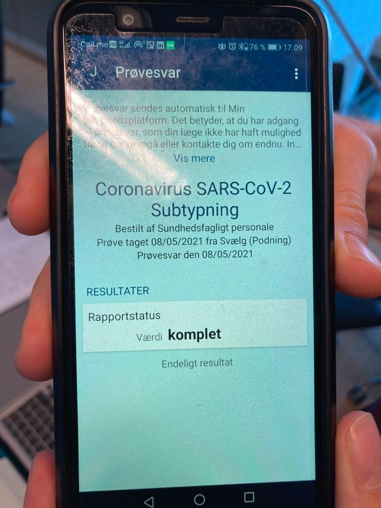

# Match between system and the real world

The system should speak the users’ language, with words, phrases and concepts familiar to the user, rather than system-oriented terms. Follow real-world conventions, making information appear in a natural and logical order.

## Examples

### Jeppe examples 

Picture of phonescreen (screenshots were not permitted in the app), of Min Sundheds Platform (not to be confused with the app Min Sunhed). It's a more local app where you as a patient communicate with hospitals prior to an appointment, and it is required to have a negative covid test, which is displayed in the app. The example is in conflict with design principle 2, since I as a user doesn't understand the 'language' the test is written in. I don't know wether my test is negative, since I don't understand the doctor 'lingo' used in the app. It's also in conflict with principle 9. See the file 9_help.md for explanation.

